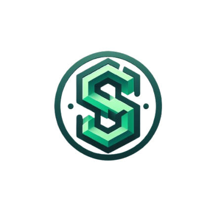

# Safi2D
Safi2D is a 2D library written in pure Python without any exernal library


# 🚨(THIS LIBRARY IS A WORK IN PROGRESS)

## Installation

```bash
pip install git+https://github.com/Benitmulindwa/safi2D.git
```
## Usage
```python
from safi2D.safi import Canvas

HEIGHT = 400
WIDTH = 600

curve = Canvas(WIDTH, HEIGHT)

# Draw a red circle
curve.draw_filled_circle(center=(WIDTH // 2, HEIGHT // 2), radius=80, color=(255, 0, 0))

curve.save("outputs/filled_circle.png")
```
This draws a red circle on a white background.
### Output:


## TODO:

- Optimize line-drawing algorithm for better performance ✔
- Implement support for ellipses and arcs ✔
- Add color and style options for shapes
- Implement transformation functions (translation, rotation, scaling)
- Integrate text rendering capabilities for annotations
- Develop event handling mechanisms for user interaction
- Extend export formats to include PNG, JPEG, and SVG ✔
- Create comprehensive documentation and examples
- Set up automated testing procedures
- Engage with the developer community for feedback and collaboration
